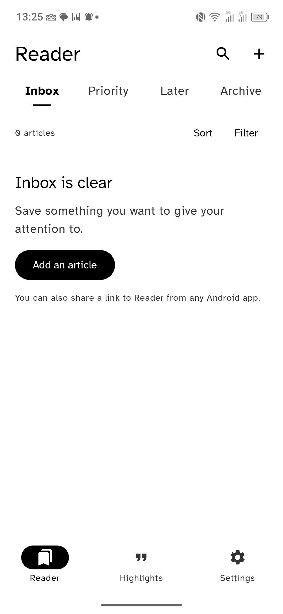
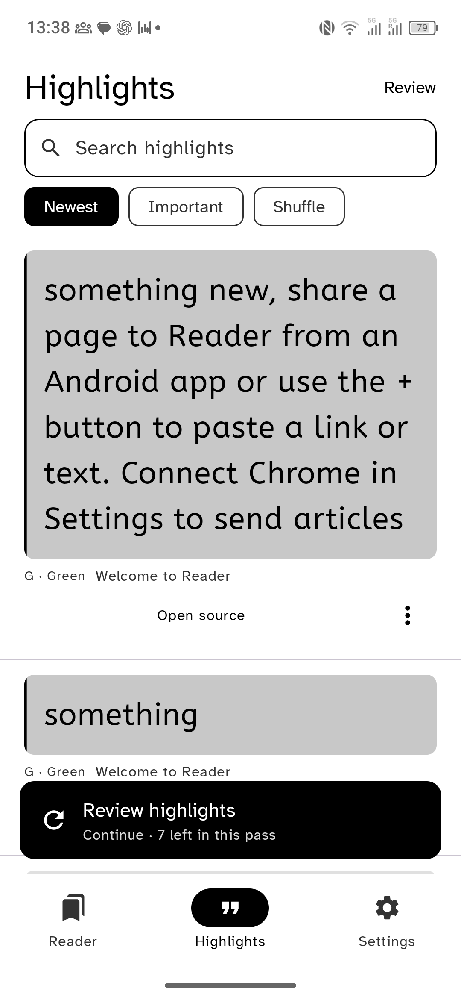
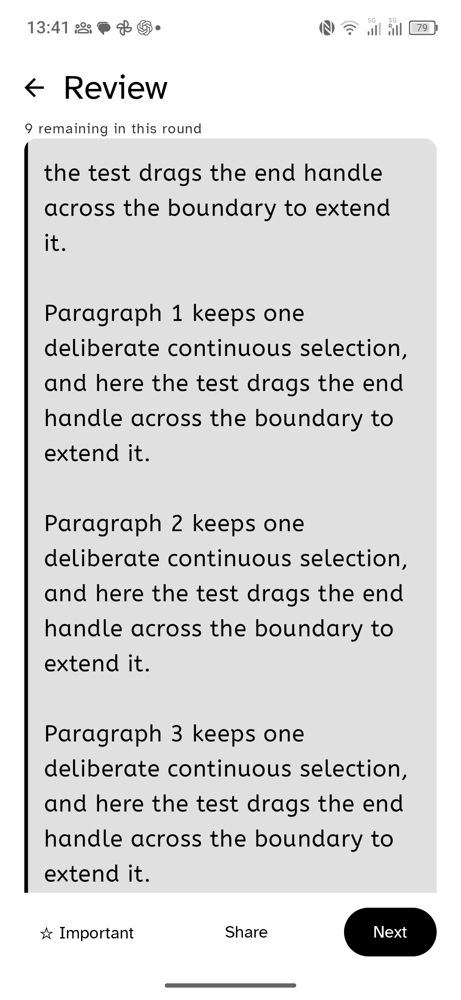
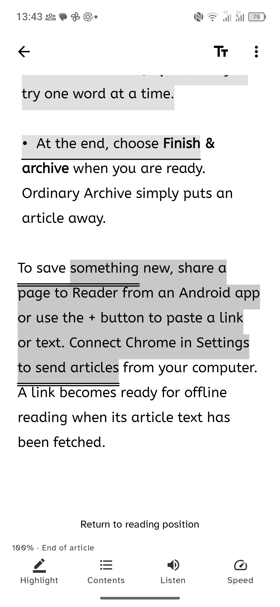
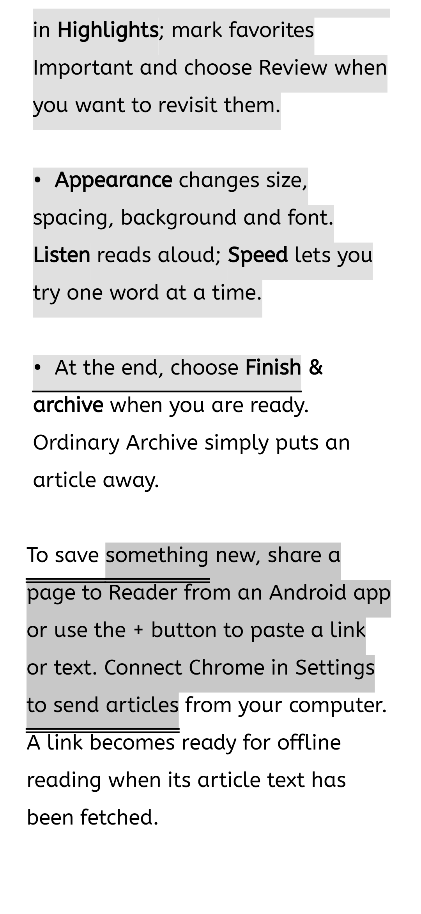
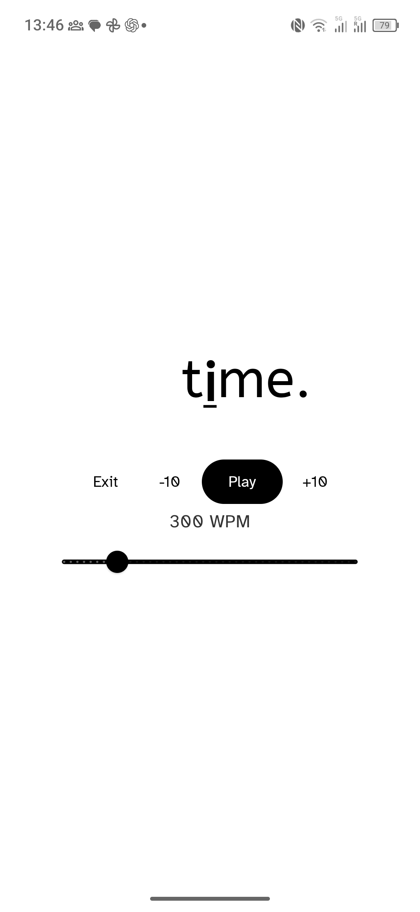

# Reader — review of Muse's polish pass and final repair plan

Date: 11 September 2026. Baseline: `80f39c4d60574a487a44b27e33c05a3648391d9d` on `codex/reliability-finalize`.

This is an audit and implementation plan, not a claim that the repairs below have shipped. The present review changes documentation and evidence only. It supersedes the remaining-work/completion statements in the earlier polish handover where they conflict. Keep the older specification for requirements that this plan does not change.

## 1. Findings first

Muse delivered substantial improvements. The remaining work is a small repair pass, not another redesign. Two highlighting defects should be fixed before treating this as a comfortable daily-reading build; a Speed color regression and source-context refinement follow.

| ID | Priority | Finding and evidence | Smallest complete repair |
| --- | --- | --- | --- |
| R1 | P1 | Saved e-ink underlines do not follow wrapped selections. On the TCL, a green multi-line mark begins at “something,” but its first double rule starts under the unselected “To save”; rules disappear on intermediate lines. `NativeArticleView.kt:583–604` uses the next line's caret as the previous line's endpoint. Current screenshots 07 and 08 below reproduce this. | Calculate selected visual runs within each line; draw each rule under its actual run, with safe vertical placement and viewport clipping. Keep text and stored ranges unchanged. |
| R2 | P1 | The ordinary Android menu's Highlight action can still create a second saved highlight when its handle is adjusted. `NativeArticleView.kt:274–278` commits before establishing `sessionRange`; the next `selectionChanged` treats the null range as a new session at lines 519–524. Its inclusive-end overlap comparison also splits some genuinely overlapping adjustments. Code-confirmed; this audit did not manually reproduce persistence. | Initialize session ownership before the first commit, use consistent half-open ranges, and retain that identity through adjustments. Add the missing ordinary-menu persistence case. |
| R3 | P2 | Speed's focal glyph now uses `colors.text` in normal themes, losing the previous blue cue. `RsvpScreen.kt:154–164`. Bold and a monochrome underline exist; the defect is the lost normal-theme focal color, not an absence of the new bold implementation. | Restore the normal `colors.focal` role while retaining monochrome black, bold and underline. Check the actual paused word in each mode. |
| R4 | P2 refinement | Long Review quotes place attribution below the initial viewport; feed attribution and actions occupy two widely separated rows. Screenshots 03/04. `ReviewScreen.kt:204–227` places source content after the scrolling quote; `HighlightsFeed.kt:477–503` places attribution and actions after each quote. This is a context/discoverability issue, not proof that the quote is unscrollable or its source missing. | Put compact source context before the quote and keep Open source immediately reachable in Review; consolidate feed actions without truncating quotes or shrinking touch targets. |

No P0 issue was found in this bounded review. This does not establish the absence of other bugs. R1 is reproduced on the current APK; R2/R3 have direct code evidence. Mixed-direction rendering, overlap ordering and long-token fitting are targeted repair considerations, not claims that each was reproduced on the phone.

## 2. Exact checkpoint and what was accomplished

| Commit | Scope | Assessment |
| --- | --- | --- |
| `a4140c3` | Android packages A–E from `READER_POLISH_PLAN_20260911.md` | Delivered the new window policy, contrast roles, highlight presentation, continuous-selection ownership, Review entry/count changes and search/Find polish. R1–R3 show why “all implemented” did not mean all behavior was correct. |
| `8b89a7f` | Chrome package F | Replaced class-wide visual-block inference with per-element marking on extraction clones. Keep this separate from Android repairs. No new live Chrome intake was performed in this audit. |
| `80f39c4` | Copy, documentation and evidence | Contains Muse's test/install record. Retain it as historical evidence; do not treat its unmeasured device checks as passes. |
| `5a3b696` | Previous Astra audit and polish plan | Background explaining the changes above. Its old defect list is not the current backlog. |

Fresh TCL observations confirm that these improvements should be retained:

- Reader and Highlights destination titles now share consistent geometry. The selected monochrome navigation icon is visible in white on black.
- Highlights has a conspicuous filled **Review highlights** banner and a header fallback. The earlier “no CTA” complaint is resolved in the state inspected.
- Highlights search is approximately 48 dp tall at the device's 456 dpi density. Do not confuse physical pixels with dp or shrink it below an accessible touch target.
- Full quotes and their color identities are visible. The normal article dock exposes **Highlight · Contents · Listen · Speed**.
- Focus expands the white reading surface to the screen edges and hides the dock and system bars in the inspected state. The previously visible black letterbox was not present.

Muse reported 247 Android unit tests, lint, 10 Chrome extraction tests plus typecheck/build, one TCL selection persistence test and 12 aligned native libraries. Those checks were not rerun for this documentation-only audit. The persistence test uses programmatic native selection changes with a real repository; it does not establish that every actual handle/menu path is correct. The separate menu gate exercises a different boundary. Keep these proof types distinct.

Installed bytes, freshly checked in this review:

| Package | SHA-256 | Treatment in this audit |
| --- | --- | --- |
| Normal `com.reader.app` | `8dc3d733635189852151f908de4c0b261fc131b0a130c974f0e7df8430c0b6e1` | Preserved; no reinstall or owner-data mutation. Archived normal artifact remains `artifacts/reader-debug.apk`. |
| QA `com.reader.app.qa` | `025bdbacfe55cdbe64aac4610abaa3a37f95767f30d2cf0168ec5747da9af5e5` | Used for the focused walkthrough. No corpus intake or app reset. |

QA state left behind: the walkthrough toggled one existing highlight Important. Reading/review navigation may also have persisted QA locations; no complete QA database-diff claim is made. No new article fixtures were created. The final foreground app is QA, with focus and Speed exited. Full observations and unmeasured paths are in `evidence/muse-review-20260911/manifest.json`.

Muse's previous `reader.db` byte comparison is a limited install observation. It is not a complete proof of preferences, WAL-resident changes, keys, pairing state or review history. No loss is alleged; simply do not expand the claim beyond its evidence.

## 3. Current device evidence and flow health

Device: TCL T807D, Android 16/API 36, serial `ZXKRS4VKGQ8PWGEQ`, 1080 × 2340, density 456 dpi. QA uses the app's E-ink / NXTPAPER theme. Screenshots prove software rendering, not the physical panel's refresh/ghosting quality.

1. **Reader destination — PASS for inspected layout.** Correct title, legible selected navigation, explicit empty Inbox action. An empty QA Inbox does not mean the owner library is empty.
2. **Highlights and Review entry — PASS for discoverability; source layout needs refinement.** Search is compact; the filled CTA is unmistakable. Full quotes are preserved.
3. **Review a long quote — usable entry; context refinement required.** Important, Share and Next remain visible. Attribution is initially below the fold. A still image does not prove clipping or inability to scroll.
4. **Open source at a highlight — FAIL for mark drawing.** The article and four controls open, with Return to reading position available. Wrapped underlines contradict the saved fill geometry.
5. **Focus mode — PASS for inspected window expansion.** Dock and system bars disappear; white content extends to the edges. This does not certify rotation, every system navigation mode, or physical camera-cutout ergonomics.
6. **Speed — PASS for the inspected monochrome cue; FAIL in the normal-theme code path.** The paused word shows a visibly heavier focal `i` with an underline. The loss of blue in normal themes is established in code, not by a fresh normal-theme screenshot.

| Axis | Verdict | Meaning |
| --- | --- | --- |
| Code review | FAIL | R1–R3 remain; no P0 identified in the bounded review. |
| UI | FAIL | R1 visibly draws incorrect rules. Headers, search, navigation, CTA and focused window improved. |
| UX | FAIL | Highlight adjustment can create duplicates; long-quote source context needs refinement. |
| Performance | NOT MEASURED | No quantitative campaign; no performance certification inferred from screenshots or past tests. |

There was no device-access blocker during this pass. Unvisited flows are unmeasured, not failed.

Accepted screenshots from this review, in flow order:

### 1 — Reader

### 2 — Highlights

### 3 — Review

### 4 — Source passage

### 5 — Focus

### 6 — Speed

## 4. Product decisions for the repair pass

The reader should trust that one intentional mark produces one saved quote, immediately recognize its extent, and return to its source without hunting. These are higher-value improvements than adding controls or visual novelty.

Keep the existing architecture and visual system. Preserve Room v13, canonical Markdown/projection text, quote anchors, the native selectable TextView, semantic cursors, part bounds and its small 8 dp inset. Do not add a surrounding article scroller, rewrite stored text to make marks fit, or deduplicate existing highlights by range.

Keep the four stored colors and their Y/G/C/P labels. Their monochrome presentation must remain distinguishable without hue. Use restrained existing gray fills plus correctly placed rules; do not introduce decorative badges into article paragraphs. Links retain their own underline behavior. The Important badge stays outside quote text. Preserve full adaptive quote text and the user's font/size preferences.

Keep the present Reader/Highlights headers, compact search, filled Review banner and header fallback. Preserve the banner's direction-aware behavior and priority of active Undo. Do not start a fresh navigation, theme, search or Review scheduler redesign. The normal-theme Speed focal color is a repair to an existing role.

## 5. Ordered implementation work

### Package A — one saved highlight per intentional selection (R2)

**Owner:** one implementer. Files: `ui/screens/NativeArticleView.kt`, related selection tests; reuse existing selection mutation/repository machinery.

1. Read the current first-commit path from menu selection through `emitSelection()` to repository mutation. Reproduce the null-owned-range case in a focused test before changing it. Do not log owner quote text.
2. Initialize both session ID and owned range before the first committed emission, whether it originated from continuous mode or the ordinary Highlight menu action. A menu-created session must not be replaced solely because its range was never initialized.
3. Normalize the boundary representation to `[start, endExclusive)`, or use the correct inclusive comparison consistently. Cover one-character selections and an adjustment retaining the old final character. Keep endpoints within the current projection.
4. An adjustment updates the active selection's existing mutation. A new deliberate non-overlapping selection gets a new identity. ActionMode recreation alone does not mean a new intentional highlight. Inspect the current resetting of `selectionCommitted` on recreation and preserve already-committed ownership where needed, without making ordinary Copy/Share save highlights.
5. Preserve immediate first-save behavior, ordered sequence numbers, existing coalescing and flushes on Done/navigation/background. Do not suppress Android handles or destroy ActionMode as a toolbar workaround.
6. Preserve guarded Undo: newly created/adjusted selection removes its one final row; editing an existing highlight restores the original metadata. Do not overwrite a later deliberate change. Do not run a cleanup over existing overlapping highlights, which may be intentional.

**Done when:** ordinary selection → Highlight → one handle adjustment → Done/reopen leaves one row with the final range and one identity; Undo acts on that final mutation. Existing continuous mode still produces one row. A separate new selection remains separate; mere ordinary text selection or Copy adds no row.

**Focused evidence:** add the missing ordinary-menu persistence case alongside the existing continuous test. Include the half-open overlap boundary in a small deterministic test. On TCL, make one actual handle adjustment and inspect the resulting row count/ID in QA. A mock menu assertion alone does not close this issue.

### Package B — correct monochrome drawing (R1)

**Owner:** the same implementer as A, because both touch `NativeArticleView.kt`. Keep this as a separate reviewable commit.

1. Reproduce screenshot 07/08's exact shape: selection starts mid-line, spans at least one complete wrapped line, and ends mid-line. Compare the native gray fill with the edge geometry after selection is dismissed. Active selection tint must not be mistaken for a saved mark.
2. Stop treating `getPrimaryHorizontal(getLineEnd(line))` as the right edge of that line. The offset can belong to the next visual line. Derive selected visual segments from native Layout geometry, retaining separate visual runs for mixed-direction text. `getSelectionPath` is one suitable source; do not collapse a multi-run path to one rectangular bounding box. Do not calculate glyph widths from character counts.
3. Draw only inside selected text runs. A partial first line begins at the selected word, complete intermediate lines receive their full rule, and a partial final line stops at the final selected glyph. Whitespace, paragraph breaks and native bullet/indent geometry must not create stray horizontal bridges.
4. Correct vertical placement using the actual line's baseline/descent and available interline gap. The double rule must remain below the selected line without touching the next line's glyphs. Reduce the rule spacing when necessary; do not silently increase article spacing or add bottom padding to hide a drawing bug. Keep dashed/dotted strokes visible and stable at the current density.
5. Apply the same content-to-viewport transform and clipping as the text. Verify one scroll, a focus toggle and one appearance reflow. Recompute geometry after width/typeface/size/spacing/projection changes. If the parent overlay fails to invalidate with child scrolling, fix that ownership explicitly; do not move rendering layers without evidence it is necessary.
6. Preserve separately reachable overlapping highlights. Render overlaps in a deterministic order and do not merge or delete their stored ranges. Cap visual stroke buildup inside the existing line gap so overlapping rules do not strike through text. The actions sheet must still expose each saved mark.
7. Keep drawing inexpensive: skip offscreen lines/ranges and reuse paints/path effects rather than allocate dashed/dotted effects for every line on every frame. Cache only layout-dependent geometry with clear invalidation. No performance benchmark campaign is needed for this local correction.

**Done when:** the settled saved fill and rules cover the same text in screenshots, remain attached during direct scrolling, and do not collide with adjacent lines. Normal-color highlights, links, selection handles, magnifier, autoscroll and semantic positions retain their behavior. Existing saved marks become correct without changing stored text, colors, IDs or anchors.

**Focused evidence:** one compact geometry regression set for partial/full/partial wrapped lines, end-at-boundary, mixed-direction visual runs and one overlap. Use one QA article for a real saved multi-line highlight, one color/style change and one scroll; inspect all four picker representations cheaply. If a style fails, repeat that style after fixing it. Do not create a broad font/device matrix.

### Package C — preserve Speed's focal cue (R3)

Files: `ui/screens/RsvpScreen.kt`, existing color/font roles and narrowly relevant tests.

1. Restore `colors.focal` for the focal grapheme in normal themes; retain `colors.text` for its neighbors. Under the effective monochrome policy use black with the existing bold and underline treatment.
2. Keep a whole grapheme intact, and measure/position the emphasized glyph at the same optical anchor using its final weight. Do not replace the entire word with bold or let emphasis make the focal position jump.
3. Inspect one paused ordinary word in each theme. The current monochrome cue is visible in screenshot 12; preserve it. Strengthen it only if the repaired candidate or the user's physical viewing feedback shows a concrete readability problem. Do not add a large box or a second animation merely to make this pass look different.
4. Make one long-token check with the selected font. The existing character-count size thresholds are only a heuristic, not proof that every token fits. If the chosen counterexample clips, fit the measured left/focal/right extents together around the fixed focal anchor. Do not ellipsize a word being read. This is a conditional correction, not permission for a typography rewrite.
5. Preserve Play/Pause, WPM, source cursor and Back behavior. Do not expand into TTS work, background audio or new Speed modes.

**Done when:** normal color mode again has its focal accent; monochrome has a readily visible bold/underline cue; the inspected long token is legible; entering/exiting Speed preserves reading position.

### Package D — keep source context within reach (R4)

Files: `ui/screens/HighlightsFeed.kt`, `ReviewScreen.kt`, existing source-navigation callbacks and copy assertions.

**Feed:** make each item read as source → quote → compact actions. Put a short source title and color identifier in a quiet header immediately above the quote. Let the full adaptive quote remain the dominant content. Use one compact action row for Open source and More, aligned with the card's content edges; eliminate the current large gap and centered floating-looking source action. Keep More's accessible name and at least a 48 dp hit area. A two-line source title may wrap; it must not push the Important badge into text. Do not restore six-line truncation.

**Review:** show source title/color and an explicit Open source action in a compact area outside the quote's vertical scroll. The long quote gets the remaining height; Important/Share/Next stay reachable. When the source was deleted, retain attribution with the existing honest unavailable-source treatment. Do not display a working-looking Open source action that cannot resolve.

Keep a long quote scrollable, not auto-shrunk to fit a single screen. Reserve the badge space outside quote glyphs. Do not duplicate source attribution again after the full quote. Use typography and boundaries already present in the app rather than a new card style.

Preserve the distinction between inspecting a feed and explicitly reviewing. Card tap still begins Review at that quote under the accepted specification; Open source and More consume their own taps. Moving attribution must not alter scheduling, award credit for rendering, start a new round or change source-return behavior. The existing banner and header fallback remain.

**Done when:** a long quote's source is identifiable immediately, Open source can be reached without reading to its end, all quote text remains reachable, and Back restores the originating feed position. Check one long and one short quote, then one enlarged-text view of these changed rows. Preserve touch targets by wrapping controls when needed.

### Package E — truthful handoff and trial installation

1. Update changed strings/behavior assertions and `docs/COPY_DECK.md` together. Mark R1–R4 individually complete only with the relevant proof. Do not rewrite historical evidence as fresh passes.
2. Run the existing fast Android unit suite, `lintDebug`, normal/QA debug builds and alignment check once after the final Android changes. Repeat only failures or checks affected by subsequent changes. Chrome remains untouched; do not rerun intake or its broad suite for Android-only repairs.
3. Keep native-library page alignment and whole-APK zip alignment as separate observations. Muse's manifest mentions a residual metadata/container alignment issue despite all 12 libraries being aligned; report the actual command results rather than relabeling every alignment axis PASS.
4. Complete the focused device gate below. Keep test artifacts in QA. Do not clear/uninstall either package as a shortcut. If running connected instrumentation, pass `-Pandroid.injected.androidTest.leaveApksInstalledAfterRun=true` so it leaves QA data installed.
5. When executing this plan after authorization, install the final normal debug APK in place with the existing signing identity, then pull/hash the installed bytes. Capture non-secret before/after integrity summaries at a consistent checkpoint: logical article/highlight/review/pairing state plus relevant preferences, accounting for WAL. Never export or print private keys. Distinguish install-only equality from legitimate changes caused by a subsequent launch/read session.
6. Launch the normal app once, confirm the familiar library opens, and leave it ready for the user. No owner-library fixture creation. Record exact source SHA, build variant, APK SHA-256, install proof, checks, limitations and the QA state left behind.
7. Leave local commits and a precise continuation pointer. Do not push, merge or release. Stop after the repaired build is handed over; the user's seven-day trial supplies the next evidence.

## 6. Efficient verification and stop rule

Use the existing QA sample and a few existing quotes. This review's untouched APK and existing historical test results are the baseline. No 100-article intake rerun, scale corpus, timed reading session, soak test, statistical campaign or exhaustive matrix.

One repair walkthrough should cover:

1. Ordinary selection → Highlight → adjust once → final saved range → Undo; briefly confirm continuous mode still suppresses the native menu and updates one highlight.
2. One saved multi-line monochrome mark → style change → scroll → focus toggle → appearance reflow. Inspect text/rule correspondence and the preserved passage.
3. One paused Speed word in monochrome and normal color, plus one long token; return to the article.
4. Long quote in feed → Review at that quote → Open source → Back; verify source context, full text and feed position. Confirm the existing CTA remains available and an active Undo can take precedence.
5. One enlarged-text look at the changed source/action rows. No additional font, language or lifecycle matrix.

A few deterministic boundary tests plus these important gestures are sufficient for this repair pass. Repeat a path only after a failure or a relevant change. A passing instrumented callback test cannot substitute for the one real handle adjustment; a screenshot cannot establish storage correctness.

Performance remains **NOT MEASURED** quantitatively. Investigate an observed stall or crash if it occurs; do not add benchmarks to earn a PASS label. Physical electrophoretic e-ink refresh, long-session comfort and uncommon device behavior remain for later evidence. Accessibility claims are limited to observed contrast/layout, named controls and reachable non-gesture actions, not a full compliance audit.

## 7. Delegation and completion contract

Astra owns priorities, design decisions and final review. Use an available implementation model at its highest supported reasoning setting for coding and focused device iteration. A single implementer owns A/B and TCL to avoid conflicting native-selection edits or simultaneous screen control. C can be delegated independently; D can follow once A/B are stable. Integrate before the final checks rather than installing competing builds.

Implement A → B → C → D → E. Preserve the installed baseline as a rollback artifact; do not downgrade the workspace to `f20828b` because the historical audit prompt says to check it out. Stop on a concrete blocker, document it precisely and continue independent authorized work. Do not stop for routine reversible decisions already specified here.

Completion means R1–R3 are repaired and verified at the focused level, R4's source context is implemented without truncation or navigation regressions, and the exact final APK is installed and handed over honestly. It does not mean “world's best” is proven or sustained use is certified.

Deferred until trial feedback: further feed aesthetics beyond the compact attribution change, a different highlight visual language, new Review scheduling controls, more search redesign, offline images, notes, accounts, cloud processing, background audio and telemetry. These would expand scope without resolving the present defects.

Before this audit there were four untracked XML captures under `evidence/polish-20260911/`: `21-feed.xml`, `22-feed.xml`, `22-reader-tab.xml`, `23-archive.xml`. Preserve them. Do not claim a clean tree while pre-existing untracked work remains, and do not silently include it in an unrelated commit.
