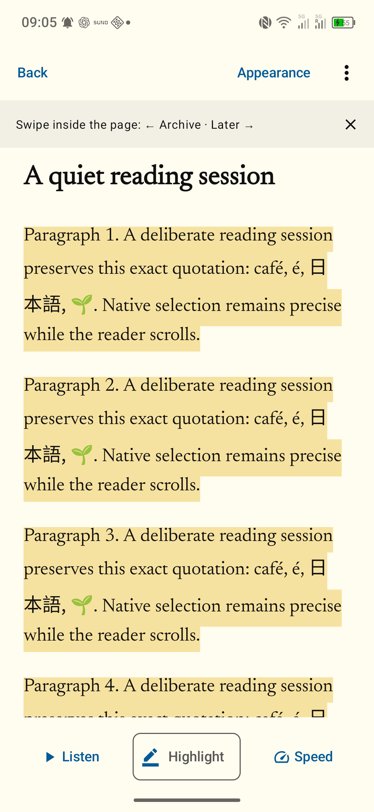
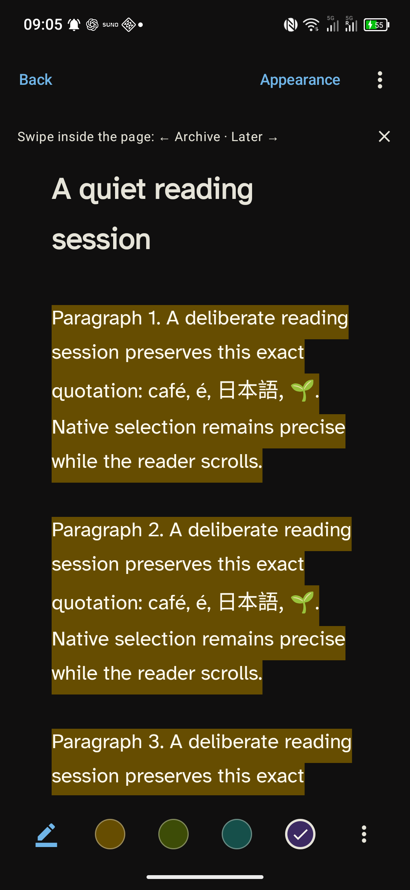
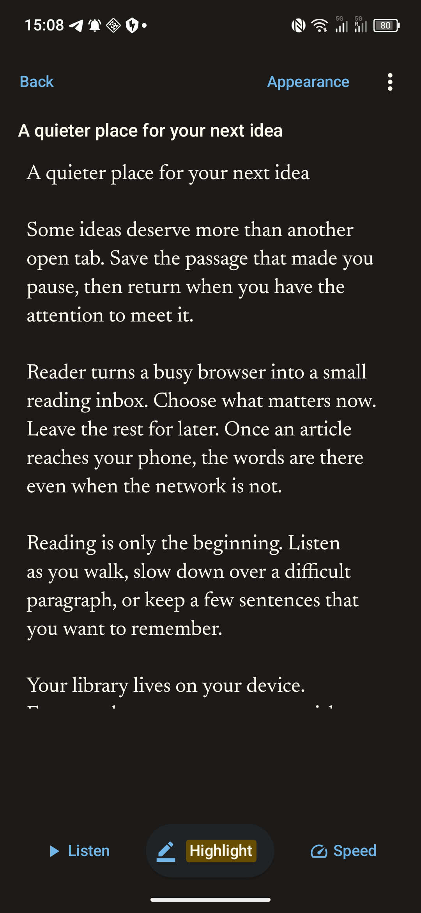
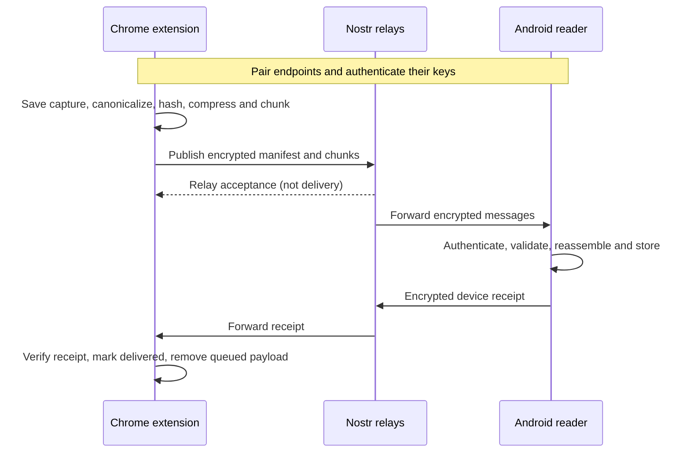

<p align="center">
  
</p>

<h1 align="center">Reader</h1>
<p align="center"><strong>A quieter place for your next idea.</strong><br>
Save from Chrome. Read, listen, and remember on Android.<br>
Encrypted delivery over Nostr. No Reader account. No Reader-operated backend.</p>

<p align="center">
  <a href="#try-reader">Get started</a> ·
  <a href="#features">Features</a> ·
  <a href="#how-nostr-is-implemented">How Nostr works</a> ·
  <a href="PROTOCOL.md">Protocol</a> ·
  <a href="LICENSE">MIT license</a>
</p>

**Current status: 0.9.0-beta.1.** Chrome → Android is implemented and has focused physical-device verification. This is a source-build beta, not a store release. macOS is a reference package; iOS is not implemented. See [known limitations](KNOWN_LIMITATIONS.md) before relying on it. The current reliability candidate, exact artifacts and scoped acceptance are recorded in [the hardening test report](HARDENING_TEST_REPORT.md).

## Why Reader?

An interesting article, a useful AI answer, a paragraph worth keeping: capture it now and give it your attention later. Reader separates collecting from consuming, with a small reading inbox and a native Android reading experience.

What makes it special is the combination:

- **Your phone holds your reading library.** Received articles remain readable offline. Reading does not depend on a Reader-hosted content service.
- **Nostr carries encrypted messages between devices.** You do not need a social profile or an existing Nostr identity. Reader generates its own transport keys and pairs the browser with the phone.
- **Delivery has a precise meaning.** A relay accepting a message is an intermediate step. Reader confirms delivery only after the paired phone authenticates, validates, and stores the article, then sends a receipt back.
- **Reading becomes something you can revisit.** Native selection, colored highlights, quote review, speech, and word-by-word reading live alongside a simple Inbox / Priority / Later workflow.
- **The protocol is open.** Schemas, cryptographic test vectors, wire rules, and both working clients are in this repository. The project is MIT-licensed.

## Screenshots

Actual screenshots from the baseline Android build on a TCL T807D, captured on 8 September 2026 using original demonstration text. These are app screens, not mockups.

<table>
  <tr>
    <td align="center"><br><strong>Read without the browser</strong></td>
    <td align="center"><br><strong>Keep the passages that matter</strong></td>
    <td align="center"><br><strong>Make reading comfortable</strong></td>
  </tr>
</table>

[View the appearance controls](docs/screenshots/appearance.png) · [Screenshot provenance](docs/screenshots/README.md)

## Features

### Capture in Chrome

- Save selected text or extract an article from the current page using the toolbar, context menu, or **Alt+Shift+R**.
- Preserve structured text as Markdown. Uncertain article extraction asks for preview confirmation.
- Capture is stored locally before transmission. Pending items can retry or export their text. Older retained plaintext copies have their own recovery library in Settings; export or delete them independently of delivery.
- Optional site integrations support response capture on ChatGPT, Claude, Gemini, and Perplexity. Other adapters are previews; current authenticated provider interfaces have **not** all been verified. See the [source support matrix](docs/beta/SOURCE_SUPPORT_MATRIX.md).
- Pair by QR code or a manual pairing payload. Settings expose connection and delivery details when needed.

### Read on Android

- Organize articles into **Inbox**, **Priority**, and **Later**, with estimated reading time and saved progress. **Archive** has its own destination beside the Add button.
- Native text rendering, links, selection handles, and normal Android Copy / Share actions. Images are represented by descriptions; remote article images are not fetched.
- Five bundled typefaces: Newsreader, Crimson Pro, Asul, Atkinson Hyperlegible, and ABeeZee. Adjust size, margins, and **Follow system / Paper / Soft / Ink / Black** backgrounds.
- **Listen** uses Google’s Android speech engine and its configured voice. **Speed** offers word-by-word RSVP reading with adjustable pace. Reading modes share semantic positions within the current article part.
- Import text through Android sharing, paste, or supported local files as well as the Chrome transport.

### Highlight and remember

- Turn on **Highlight**, select text, and adjust the native handles. Choose yellow, green, cyan, or purple; saving is automatic and silent.
- Highlight mode hides the floating Android action menu while retaining native selection. **Undo highlight change** is available in the article’s overflow menu.
- Browse quotes by **Shuffle** or **Newest**, review them individually, mark important passages, and share quote text.
- In Highlights, swipe right to mark a passage important (yellow star, top right) or left past the mark to remove the quote. Long-press selects several quotes to remove at once. Removed quotes have no Undo; their articles stay in your library.
- Long-press articles to select several and archive or unarchive them together, with Undo. Permanent deletion remains an explicit single-article action inside Archive.
- Saved highlights and review history survive permanent deletion of the source article. The retained quote shows its source title and identifies when the local source is gone.

### Finish and move on

- Swipe inside an article to move it to Later or Archive, with Undo. Menu alternatives are available.
- In Archive, swipe right to return an article to Inbox. Swipe left past the deletion threshold and release to **delete it permanently, without confirmation or Undo**. These actions work on archive rows and open archived articles.
- Export a verified ZIP of readable Markdown, versioned metadata and retained quotes to a destination you choose. Exports are one-way files, **not** a restorable backup or a transfer of pairing keys.

## How Nostr is implemented

Reader uses Nostr as a transport for private device-to-device delivery. Articles are not published as public social posts. There is no Reader application server to register with or run, but delivery does depend on independently operated Nostr relay servers and their availability.



### Pairing and identity

Chrome creates a short-lived pairing request containing public keys, a session nonce, and an authenticated relay-set digest. The QR contains **no private key**. Android validates the request and shows the fingerprint and relay list before connection.

A `pair-response → pair-ack → pair-complete` exchange binds both endpoints to that session and relay set. Chrome shows a connected channel only after verifying Android’s completion. Android channel secrets are wrapped with Android Keystore; Chrome secrets live in trusted extension storage. Reader does not require the user’s personal Nostr key.

### Encryption and message format

The application protocols are `reader-pair/2` and `reader/2`:

| Layer | Implementation |
| --- | --- |
| Application payload | Unsigned kind `30078` rumor with a canonical Nostr event ID |
| Sender authentication | Signed kind `13` seal |
| Encryption | NIP-44 v2 for the rumor and seal |
| Relay envelope | NIP-59 kind `1059` gift wrap, with a fresh outer key and wrapper for each relay |
| Routing and lifetime | Recipient `p` tag and NIP-40 expiration tag |
| Validation | Wrapper/seal signatures, trusted sender, recipient, expiry, exact schemas, hashes and size limits |

There is no NIP-04 or plaintext fallback. The normative [protocol specification](PROTOCOL.md) defines the precise validation order, pairing state machine, retry rules, and compatibility boundaries.

### Articles, retries, and receipts

Canonical Markdown is hashed with SHA-256 to produce the document identity, gzip-compressed, and split into bounded chunks. An encrypted manifest binds the hashes, lengths, chunk count, endpoints, and expiry. Android accepts out-of-order chunks, verifies the complete document, and commits it to Room before acknowledging it. Replays do not create duplicate library entries.

The default relay set contains six relays; Chrome can add up to two custom secure relays. A channel’s changed relay set takes effect through re-pairing. Publication targets a two-relay write quorum. Persistent outboxes, browser alarms, Android WorkManager, bounded retries, and rolling catch-up support interrupted delivery. They do not promise immediate background delivery under every OS or network condition.

**Relay acceptance ≠ phone delivery.** Only a valid `stored` or `duplicate` receipt from the paired Android channel settles the sender’s delivery state and removes the captured payload from the outbox.

### Privacy boundaries

Article content is encrypted in transit and stored locally for reading. Relays can still see routing keys, IP addresses, timing, and approximate sizes. NIP-44 does not provide forward secrecy; compromised endpoints can expose local text and keys. Expiration tags and local deletion do not guarantee erasure from relay storage or previous exports. Reader has no application telemetry backend.

Read the [threat model](THREAT_MODEL.md), [security and privacy notes](SECURITY_AND_PRIVACY_NOTES.md), and [security policy](SECURITY.md) for details. Encryption is not a claim of anonymity or an independent security audit.

## Try Reader

You currently build the beta from source. Generated APKs and extension ZIPs are excluded from Git; [ARTIFACTS.json](ARTIFACTS.json) records local candidate provenance, not public download links.

### Chrome extension

Use Node.js **22.12 or newer** and npm (the current Vite toolchain requires a recent Node release).

```sh
cd chrome
npm ci
npm run typecheck
npm test
npm run build
```

Open `chrome://extensions`, enable **Developer mode**, select **Load unpacked**, and choose `chrome/dist`. The manifest declares Chrome 120+, but the full range of browser versions has not been qualified.

### Android

Use JDK 17 and an Android SDK installation with platform 34. Configure its location through Android Studio, `ANDROID_HOME`, or a local `android/local.properties` file.

```sh
cd android
./gradlew assembleDebug
adb install -r app/build/outputs/apk/debug/app-debug.apk
```

The app declares Android 8.0/API 26+; the current focused acceptance device is a TCL T807D running Android 16. This build is debug-signed. Google speech must be installed and enabled for Listen. Preserve an existing Reader installation’s data and keys when updating; do not uninstall just to bypass a signing mismatch.

Open the extension’s pairing screen and use Android’s Add menu to scan or paste the pairing request. Confirm the connection, save an article from Chrome, and wait for the phone’s receipt. See the [installation and trial guide](docs/beta/INSTALL_AND_TRIAL.md) for the full workflow.

Current reliability-cycle implementation and evidence: [RELIABILITY_HARDENING.md](RELIABILITY_HARDENING.md).

## Development and documentation

| Location | Purpose |
| --- | --- |
| [`chrome/`](chrome/) | TypeScript Manifest V3 capture extension and transport |
| [`android/`](android/) | Kotlin, Compose, native article view, Room and WorkManager |
| [`shared/`](shared/) | Schemas, fixtures, relay defaults and cross-runtime vectors |
| [`rust-core/`](rust-core/) | Shared algorithm/reference implementation |
| [`mac/`](mac/) | Reference Swift package; not a finished Mac product |
| [`PROTOCOL.md`](PROTOCOL.md) | Authoritative v2 wire contract |
| [`ARCHIVE_REFRESH.md`](ARCHIVE_REFRESH.md) | Latest archive/highlighting behavior and focused verification |
| [`UI_REFRESH.md`](UI_REFRESH.md) | Branding, reader dock, Google speech and preceding UI checks |
| [`BETA_TEST_REPORT.md`](BETA_TEST_REPORT.md) | Earlier beta evidence checkpoint |
| [`KNOWN_LIMITATIONS.md`](KNOWN_LIMITATIONS.md) | Outstanding acceptance and implementation limits |

Android checks can be run with `cd android && ./gradlew test lint assembleDebugAndroidTest`. Device instrumentation needs an attached Android target; it is distinct from host unit tests. Protocol vectors live in `shared/test-vectors/`. Historical test reports describe their recorded builds, not an automatic certification of every later commit.

Contributions should identify the affected client, preserve the v2 wire contract, and include verification appropriate to the change. Report bugs with the app/build version, platform, reproduction steps, and sanitized diagnostics; never include private keys or private article content.

## Credits and license

Vision and guidance: **Marius Schober**<br>
Development and implementation: **AI**<br>
**One human. Many tokens.**

Released under the [MIT license](LICENSE). Bundled dependency and font notices are in [LICENSES/](LICENSES/).
